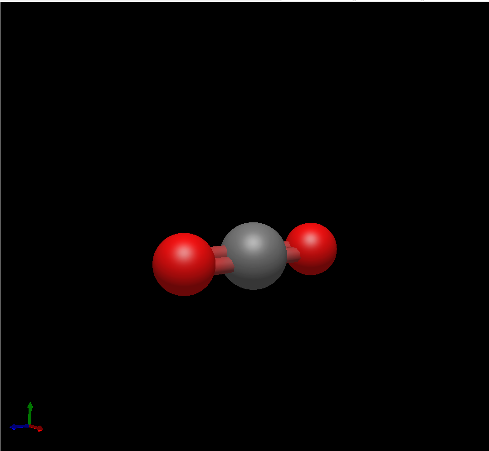
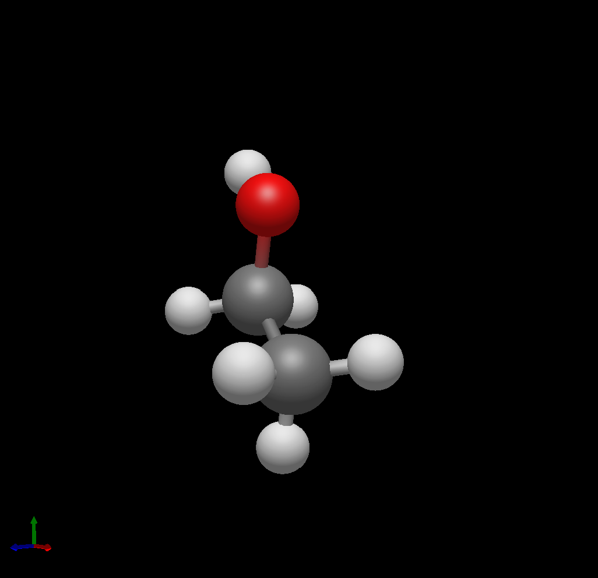

# Where is the Math in: Molecular Vibrations?
## About Me

#if youre reading this you're a nerd
My name is Daniel Gonzalez. I am currently studying for a Bachelor of Science in Chemistry with minors in Mathematics and Biological Sciences. Although I initially started as a Biology student, it was during my mathematical courses and my time conducting chemistry research that I fell in love with the abstract worlds of Mathematics and Chemistry. During this time, I began taking more math courses and changed my major to Chemistry; up to now, I have covered the following courses:

- Calculus I
- Calculus II
- Calculus III
- Linear Algebra
- Mathematical Modeling (currently)

While also taking more theoretical courses in Chemistry, such as Descriptive Inorganic Chemistry and Spectroscopy. During these courses, I was able to find applications for the math courses I had taken, and where my interest in theoretical chemistry began. With support from Dr. Jesus Alberto Lopez Dominguez, we began to explore ideas to work on a project regarding molecular vibrations. 

## What are Molecular Vibrations?
The following two videos can help give an initial or a deeper understanding of the topic, as you choose.

- [Shorter Video](https://www.youtube.com/watch?v=DJI518yTr2c)
- [More In-Depth Video](https://www.youtube.com/watch?v=Ha5yWbxOqFk&t=368s)

Alternatively, you can check out my video on the subject, which covers the content presented in this section:

### Motion in Molecules
The way atoms or molecules "move" can be simplified or expressed through three main ways:
1. Translation
2. Rotation
3. Vibration

In more general terms, for any displacement in three dimensions, atoms exhibit 3 degrees of freedom. Each atom in a molecule will add 3 degrees of freedom to the overall displacement of the molecule, giving us a total amount of displacements a molecule can have as:

$$3N$$

where N = # of atoms in the molecule.

In our three-axis system, any molecule will use three degrees of freedom to move along the axis (translation) and three to rotate around an axis (rotation). This means that we have $3N-6$ remaining degrees of freedom. If our molecule is linear, meaning rotation along one axis effectively does nothing, then we have $3N-5$ remaining degrees of freedom.

 

These remaining degrees of freedom will contribute to the vibrational motion of a molecule. For non-chemists, another way to think of it is that the degrees of freedom will describe ways in which a molecule can store kinetic energy.

You can describe all motion in a molecule through what are known as normal modes. If you have taken linear algebra, you can relate this to the basis of a vector space. Any type of motion in a molecule can be described as a combination of the normal modes, and the normal modes cannot form each other.

### Bonds as Harmonic Oscillators

We can create an initial approximation by considering bonds and atoms as objects on springs, using equations for what are known as simple harmonic oscillators. The real use of these equations is to derive a quantized version of them for use in molecules.

We can derive the equation for any classical simple harmonic oscillator through the use of differential equations, as is shown in [Hands On: Simple Harmonic Oscillator](hands-on/1_harmonic_oscillator.md).

### Applying Quantum Behavior (WIP)
We must remember, though, that in the world of subatomic particles, classical mechanics stops describing the physical properties and behavior of objects. We must instead turn to Quantum Mechanics.

It was Einstein who first proposed a quantized model of the harmonic oscillator to describe the heat capacity of solids.

$$E = \hslash \omega \left(n + \frac{1}{2}\right)$$

If you know German, you can read [Einstein's original paper on this.](https://doi.org/10.1002/andp.19063270110)

A future addition will be the derivation of the quantum harmonic oscillator using Schrodinger's equation at [Hands On: Quantum Harmonic Oscillator](hands-on\2_quantum_harmonic_oscillator.md).

### Why Study Vibrations?
Vibrations can tell us a lot of information about the molecule. Beginning with IR and Raman spectroscopy, which allow for molecular fingerprinting, detecting groups within a molecule by the wavelengths of light that are absorbed to excite vibrational states. Vibrations, by describing bonds, also describe the strength and type of bonds existing within molecules, which can be useful to predict reactivity. A study of thermodynamics could use molecular vibrations, as Einstein did originally.

## Conclusions
Vibrations describe the remaining displacements of a molecule after translations and rotations have been taken into account. These vibrations, first identified through IR spectroscopy, have provided valuable insights into the structure and bonding of molecules. Nevertheless, the complexity of quantum behavior makes any modelling of the phenomenon difficult. 

My approach to learning was working down from surface-level knowledge to getting into the details slowly. Most of this information was covered in previous university courses I have taken, but the fine details were obtained through external resources. As a visual learner, I benefited greatly from audiovisual content, particularly YouTube videos, to fill in gaps or create an initial understanding of the topics.

Nevertheless, I have only scratched the surface of this topic. My biggest challenge was the overwhelming amount of information, finding good resources that helped ME understand, and coming to terms with the complexity of mathematics and quantum mechanics. 

Still, this has not stopped my intrigue and desire to know more. With the help of my professors, particularly Dr. Lopez and Dr. Hugo Flores, I am inspired to keep working, as without their help, this spark of curiosity and its development would not have been possible.

## References
Atkins, P. W. (2010). Shriver & Atkins’ Inorganic Chemistry. Oxford University Press.
- This book, alongside the Descriptive Inorganic Chemistry course, was my first introduction to the concept of molecular vibrations and gave explanations based more on group theory. Nevertheless, it also goes into details on degrees of freedom and normal modes of vibration.

Bright Wilson, E., Decius, J. C., & Cross, P. C. (1980). Molecular Vibrations: The Theory of Infrared and Raman Vibrational Spectra. Dover.Cremer, D., & Kraka, E. (2010).
- This book was used for the content of my spectroscopy course and goes into great detail on all the concepts covered in this project. This includes the harmonic oscillator model, normal modes of vibration, degrees of freedom, and its links to IR and Raman spectroscopy.

From Molecular Vibrations to Bonding, Chemical Reactions, and Reaction Mechanism. Current Organic Chemistry, 14(15), 1524–1560. https://doi.org/10.2174/138527210793563233
- This article will prove to be very useful when going deeper into the more complicated mathematics of molecular vibrations. It serves to provide a bridge between bonding and molecular vibrations.

Einstein, A. (1907). Die Plancksche Theorie der Strahlung und die Theorie der spezifischen Wärme. Annalen Der Physik, 327(1), 180–190. https://doi.org/10.1002/andp.19063270110
- This is referenced in the directory as the first appearance of the quantum harmonic oscillator.

Herman, R. (2021, November 15). 2.3: Simple Harmonic Oscillators. Mathematics LibreTexts. https://math.libretexts.org/Bookshelves/Differential_Equations/A_First_Course_in_Differential_Equations_for_Scientists_and_Engineers_(Herman)/02%3A_Second_Order_ODEs/2.03%3A_Simple_Harmonic_Oscillators
- This provides the initial surface-level understanding of Hooke's Law and the derivation of the  simple harmonic oscillator model.

Kowolik, K. (2013, October 2). Normal Modes. Chemistry LibreTexts. https://chem.libretexts.org/Bookshelves/Physical_and_Theoretical_Chemistry_Textbook_Maps/Supplemental_Modules_(Physical_and_Theoretical_Chemistry)/Spectroscopy/Vibrational_Spectroscopy/Vibrational_Modes/Normal_Modes
- Additional context regarding normal modes of displacement and degrees of freedom of molecules.

Ogilvie, J. (1989). Infrared Spectroscopy of Diatomic Molecules-the First Century. CHINESE JOURNAL OF PHYSICS, 27(4). https://www.cecm.sfu.ca/personal/ogilvie/jfopub/89infrDi.pdf
- While not mentioned in the repository, this was initially mentioned during the first Hands-On presentation, as it provides historical context for the evolution of the creation of the concept of molecular vibrations.

Quantum Sense. (2023, January 3). Ch 1: Why linear algebra? | Maths of Quantum Mechanics. Www.youtube.com. https://www.youtube.com/watch?v=3nvbBEzfmE8
- Initial reference for a planned future derivation of the quantum harmonic oscillator. The entire series provides an initial and comprehensive understanding of the mathematics in quantum mechanics.

Santa Cruz Institute for Particle Physics. (2009). Physics 5B: Solving the Simple Harmonic Oscillator. https://scipp.ucsc.edu/~haber/ph5B/sho09.pdf
- Main reference used for the derivation of the simple harmonic oscillator equation.

Simons, J. (2014, May 21). 3.2: Normal Modes of Vibration. Chemistry LibreTexts. https://chem.libretexts.org/Bookshelves/Physical_and_Theoretical_Chemistry_Textbook_Maps/Advanced_Theoretical_Chemistry_(Simons)/03%3A_Characteristics_of_Energy_Surfaces/3.02%3A_Normal_Modes_of_Vibration
- Additional information regarding normal modes of vibration.
